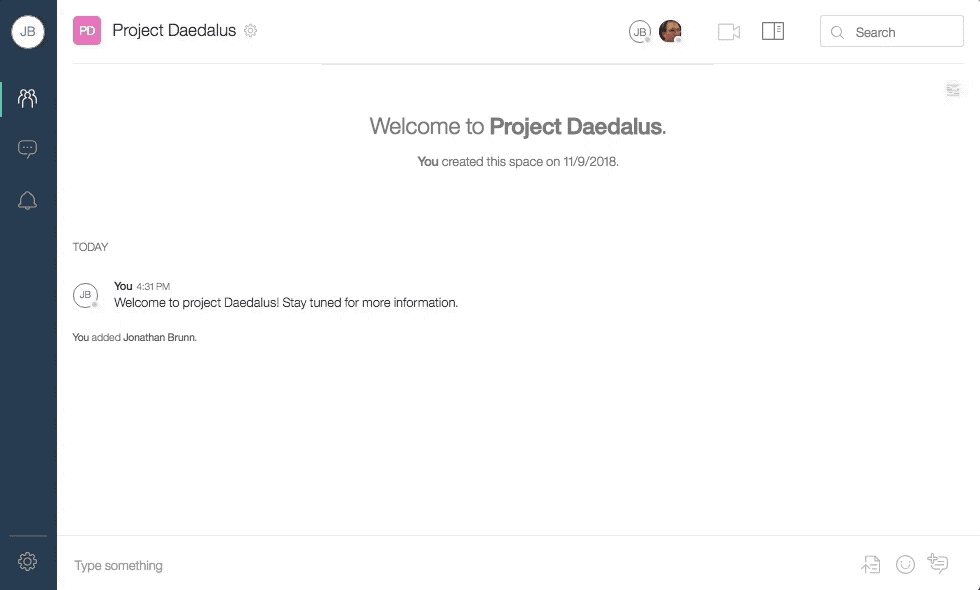

# Watson Workspace Export Utility

This repository contains a Python project to export the contents of Watson Workspace for a given user.

The included script will find all your spaces, then iterate over each one to
- create an appropriate folder structure in your home directory
- export a csv file with information about members of the space
- iterate over messages, starting with the oldest, and printing all to CSVs, organized into folders by year and given a name `messages [month].csv`

This can be a very long running process, and currently, it is possible for a JWT token to expire partially through the export.

Due to the possible expiration of the JWT auth token, and potential for other issues or network disruptions during such a long running process, the export was made resumable. If the tool detects messages already exported for a space, it will attempt to find the most recently message and will continue from that point. This feature is also useful if you want to export a space, and then later on rerun the export to get new messages since your last export. In this case, the tool can be used to incrementally export a space, though it will not consider message edits or deletions.

## Setup

1. Make sure you have Python 3.x installed (check with `python --version`). Note: this package was developed with python 3.7.
2. Install required packages. There are many ways to do this, but the most simple may be to run `pip install -r requirements.txt` from the project directory (you may need to use `pip3` instead of `pip` depending on your environment). A Pipfile is also provided if you choose to use pipenv commands.

## Running

### As a user

1. Change to the directory containing this project
2. Obtain your JWT from Workspace

3. Run `python -m wwexport --jwt=WATSON_WORK_JWT`

### As an app

1. Change to the directory containing this project
2. Obtain an app ID and secret from https://developer.watsonwork.ibm.com/apps
3. Add the app to spaces to be exported
4. Run `python -m wwexport --appcred APP_ID:APP_SECRET --spaceid SPACE_TO_EXPORT`

Run `python -m wwexport -h` for more options, including options on exporting files.

When files are exported, additional metadata files are created to save information about file creators, dates, and the relationship of file IDs to paths on the local file system. This aids when resuming an export since the tool uses the metadata files to skips downloads of files already downloaded. Unless IDs were used as file names (which is not very user friendly), it is otherwise not possible to know which files were downloaded without meta files, since multiple files can have the same name in a space. These meta files are also helpful in knowing information on the message associated with a file, or finding the file corresponding to a message.
